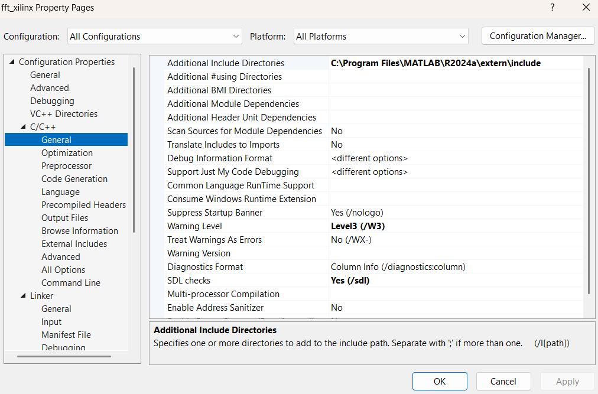
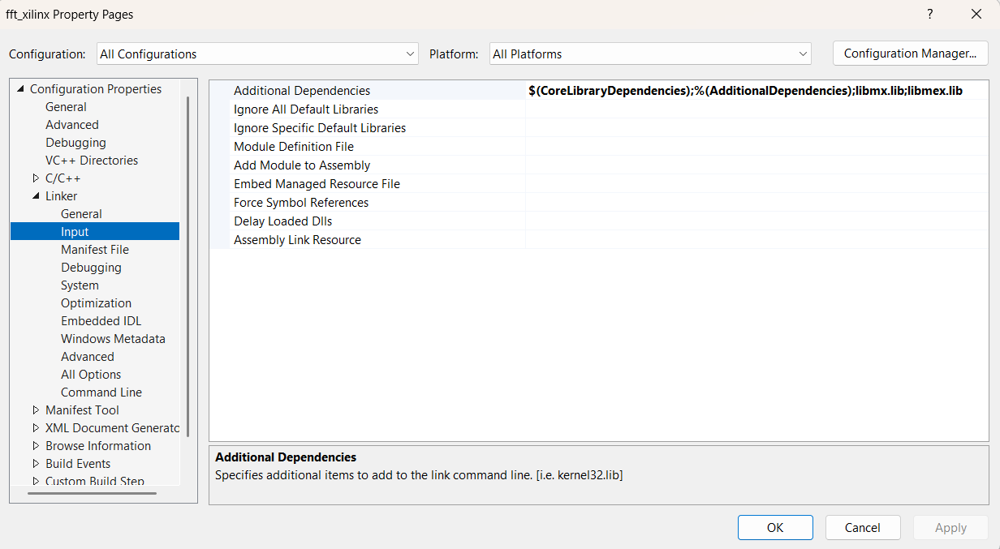
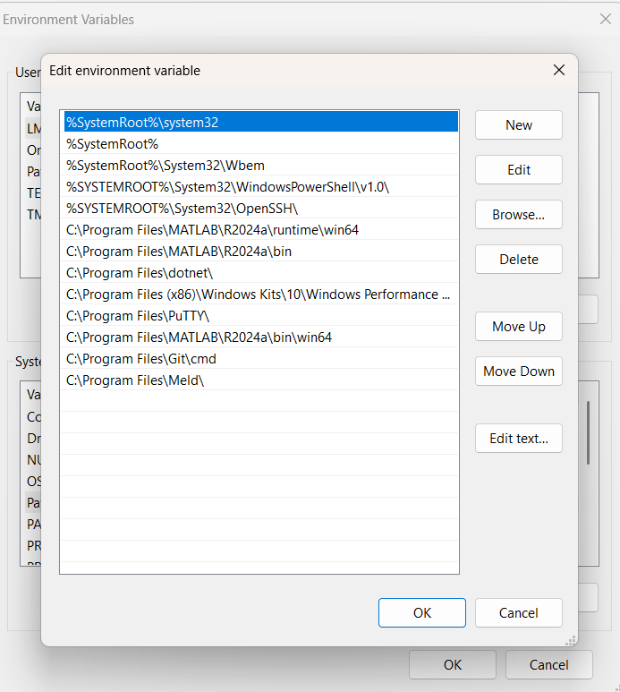

# 📘 FFT/IFFT IP – Hardware & C-Model Verification

## 🔹 Introduction
- The **Xilinx FFT/IFFT IP** is a high-performance, configurable transform engine for computing **Fast Fourier Transform (FFT)** and **Inverse FFT (IFFT)** on FPGA hardware.  
- It supports multiple operational modes including **Scaled / Unscaled**, **Real-Time / Non-Real-Time**, and **Runtime / Fixed Configuration**.  
- The FFT/IFFT IP has AXI4 Stream interface making it suitable for integration with **FIFO Generator IP** and **AXI DMA IP** for data transcations.

---

## 🔹 Configuration Overview
The FFT/IFFT core working mode depends on three main configurations:

- **Scaled/Unscaled Mode** – Allow FFT to handle overflow due to bit growth on different FFT stages or generate full precision data.  
- **Fixed/Runtime Configuration** – Allows the use to dynamically update FFT/IFFT parameters (length, direction, scaling) through streaming interface or make it fix.  
- **Real-Time/Non-Real-Time Operation** – Configure FFT/IFFT core to process continuous streaming of live data or process the discrete data stored in memory.

---

## 🔹 Operational Modes

| Mode Type | Description | Configuration Source |
|------------|--------------|----------------------|
| **Scaled** | Applies stage-wise scaling to prevent overflow. | Runtime / Non-Runtime |
| **Unscaled** | Performs full-precision FFT without internal scaling. | Runtime / Non-Runtime |
| **Real-Time** | Requires continuous streaming input through FIFO Generator IP. | FIFO + FWFT enabled |
| **Non-Real-Time** | Uses DMA transfers (discrete frames, no continuous data). | AXI DMA |
| **Runtime Configurable** | FFT parameters (length, direction, scaling) updated at runtime via valid/ready handshake. | Config Port |
| **Non-Runtime Configurable** | Fixed configuration set at synthesis or initialization. | IP Parameters |

---

## 🔹 Real-Time vs Non-Real-Time

| Design Aspect | Real-Time | Non-Real-Time |
|-----------|------------|----------------|
| Requires Continuous Data | ✅ Yes | ❌ No |
| Uses FIFO Generator (FWFT) | ✅ Yes | ❌ No |
| Handshake Required (tvalid/tready) | ✅ Yes | ✅ Yes |
| Data Source | FIFO Stream | DMA |
| Latency Handling | Continuous | Frame-Based |
| Use Case | Real-time audio, sensor streams | Batch FFT processing |


**Explanation:**
- In **real-time mode**, data must continuously flow to the FFT input.  
- The **FIFO Generator IP** is used with **First Word Fall Through (FWFT)** enabled to ensure that **the very first data word is valid as soon as `tvalid` goes high**, rather than being zero or garbage.  
- Typically, `tready` may already be high before transmission starts — FWFT mode guarantees that when `tvalid` is asserted, the **first valid sample** is immediately presented on the output bus.  
- This ensures clean and accurate streaming without initial data corruption at the start of each frame.


---

## 🔹 Scaled vs Unscaled Operation

| Operational Aspect | Scaled | Unscaled |
|-----------|---------|-----------|
| Overflow Protection | ✅ Enabled | ❌ Disabled |
| Scaling Factor | User-defined (per stage) | None |
| Dynamic Range | Reduced per stage | Full precision |
| Configuration Bits | Include scaling schedule | Direction + Length only |
| Use Case | Stable fixed-point computation | Maximum accuracy required |

**Explanation:**
- In **scaled mode**, each FFT stage applies a right shift to prevent overflow.  
- The **scaling schedule** defines where these shifts occur.  
- In **unscaled mode**, no internal scaling is applied, allowing maximum precision but a higher risk of overflow.

---

## 🔹 Runtime vs Non-Runtime Configuration

### ⚙️ Runtime Configuration Mode
Parameters like **FFT length**, **direction**, and **scaling** are configured dynamically using handshake signals:

- s_axis_config_tvalid
- s_axis_config_tready

**Explanation:**

- The configuration is captured on the rising edge of the clock when both **`s_axis_config_tvalid`** and **`s_axis_config_tready`** are high — this is known as the **valid–ready handshake**.  
- After a valid configuration is received, **`s_axis_config_tready`** remains high for **one clock cycle** and then deasserts (goes low).  
- Once the handshake occurs, **`s_axis_config_tvalid`** must be deasserted (set low).  
- The reason is that **`s_axis_config_tready`** stays low until the next FFT frame is ready to start.  
- By deasserting `s_axis_config_tvalid` after the handshake, the design ensures that `s_axis_config_tready` can go high again before the next frame — allowing a new configuration to be applied for the following operation.


## 🔹 Example Bit Mapping (Runtime Mode)

| Mode | Configuration Word | FFT Length | Direction | Scaling Schedule Bits |
|------|--------------------|-------------|------------|------------------------|
| **Unscaled (Runtime)** | [15:0] | [4:0] | [8] | — |
| **Scaled (Runtime)** | [23:0] | [4:0] | [8] | [18:9] |

---

## 🧩 Non-Runtime Configuration Mode  
Configuration is fixed during synthesis or initialization.  
No valid/ready handshake is required — configuration is set once.

| Mode | Configuration Word | Direction | Scaling Schedule Bits |
|------|--------------------|------------|------------------------|
| **Unscaled (Non-Runtime)** | [7:0] | [0] | — |
| **Scaled (Non-Runtime)** | [15:0] | [0] | [10:1] |

---

## 🔹 Data Format

### Input Data Format (Fixed-Point)
Both Scaled and Unscaled use the same packed input format:

| Mode | Real Bits | Imag Bits |
|------|------------|-----------|
| Scaled | [15:0] | [31:16] |
| Unscaled | [15:0] | [31:16] |

### Output Data Format (Fixed-Point)
| Mode | Real Bits | Imag Bits |
|------|------------|-----------|
| Scaled | [15:0] | [31:16] |
| Unscaled | [26:0] | [58:32] |

**Explanation:**
- **Scaled mode** keeps smaller bit width to control growth.  
- **Unscaled mode** expands bit width to maintain full-precision results from multiplication and accumulation.

---
## 🔹 Summary Table

| Mode | Scaling | Configuration | Data Type | Real-Time | Data Source | Notes |
|------|----------|----------------|------------|-------------|--------------|--------|
| FFT (Scaled) | ✅ Yes | Runtime / Non-Runtime | Fixed | ✅ / ❌ | FIFO / DMA | Stage-wise scaling |
| FFT (Unscaled) | ❌ No | Runtime / Non-Runtime | Fixed | ✅ / ❌ | FIFO / DMA | Full precision |
| IFFT (Scaled) | ✅ Yes | Runtime / Non-Runtime | Fixed | ✅ / ❌ | FIFO / DMA | Inverse transform |
| IFFT (Unscaled) | ❌ No | Runtime / Non-Runtime | Fixed | ✅ / ❌ | FIFO / DMA | Highest dynamic range |

---

## 🔹 Notes
- **Scaling Schedule** helps prevent overflow by applying right shifts at specific FFT stages.  
- **FWFT (First Word Fall Through)** in FIFO Generator ensures the first valid data sample is instantly available.  
- Continuous handshake (`s_axis_tvalid`, `s_axis_tready`) ensures no sample loss in **real-time** mode.  
- **Non-Real-Time operation** with DMA uses burst data transfers, ideal for offline or batch FFT processing.

---


## ⚙️ C-Model Setup

The **Xilinx FFT/IFFT IP** provides a **C-Model** for software-level simulation and verification.  
Before compiling, you must configure your C/C++ project so the compiler can locate the required MATLAB header and library files.  

This setup allows you to compile and run the FFT/IFFT C-model in tools like **Visual Studio** for verifying the transform outputs against hardware behavior.

---

### 🔹 Update Include Path
-  In **Visual Studio**, right-click on the project (e.g., `fft_xilinx`) in **Solution Explorer** and select **Properties**.  
- Navigate to: **Configuration Properties → C/C++ → General**  
- Locate **Additional Include Directories** and add the MATLAB `extern/include` path. For example:  
```
E:\Program Files\MATLAB\R2024a\extern\include
```
📸 **Screenshot Example:**


---

### 🔹 Additional Dependencies
- In the same project properties, navigate to:  
**Configuration Properties → Linker → Input**  
- Locate **Additional Dependencies** and add the MATLAB library files required for linking. Example: 
``` 
$(CoreLibraryDependencies);%(AdditionalDependencies);libmx.lib;libmex.lib
```
📸 **Screenshot Example:**


---

### 🔹 Update Library Path
- In the same project properties, navigate to:  
- **Configuration Properties → Linker → General**  
- Locate **Additional Library Directories** and add the MATLAB library path. Example:  
```
E:\Program Files\MATLAB\R2024a\extern\lib\win64\microsoft
```

⚠️ Replace this with the actual MATLAB installation path on your system.

📸 **Screenshot Example:**


---

## 🌍 Environment Variable Setup

To execute the **FFT/IFFT C-Model** correctly, MATLAB runtime paths must be added to your system **Environment Variables**.  

This ensures the executable can locate MATLAB runtime libraries during execution.

---

### 🔹 Steps
- Open **System Properties** → **Environment Variables**.  
- Under **System variables**, edit the `Path` variable and add the following directories (update according to your MATLAB version):  
```
E:\Program Files\MATLAB\R2024a\bin\win64
E:\Program Files\MATLAB\R2024a\runtime\win64
E:\Program Files\MATLAB\R2024a\bin
```


 Click **OK** to save changes and restart your IDE or terminal for them to take effect.  

⚠️ Make sure to replace `E:\Program Files\MATLAB\R2024a\` with your actual MATLAB installation directory.

📸 **Screenshot Example:**



---

✅ **Summary:**
- Add MATLAB include and library paths in your C/C++ project.  
- Link with `libmx.lib` and `libmex.lib`.  
- Set MATLAB runtime paths in system environment variables.  
- Rebuild and run your FFT/IFFT C-model for verification.


## 🔧 Important IP Settings for C-Model

To ensure the C-Model behaves exactly like the hardware FFT/IFFT IP, you must define parameters that match the hardware configuration.
These parameters determine FFT length, scaling behavior, rounding, and data precision.

### 📏 FFT Configuration Macros
```
const int fft_len_in_bits     = 10;             // log2(FFT Length) = 10 → 1024-point FFT
const int use_floating_point  = 0;              // 0 = Fixed-point mode, 1 = Floating-point
const int input_type          = sizeof(s16);
const int input_width         = 16;             // 16-bit real, 16-bit imaginary
const int twiddle_width       = 16;             // Bit-width for twiddle coefficients
const int has_scaling         = 1;              // Enable internal block scaling
 const int transform_direction = 1;             // 1=FFT, 0=IFFT

```

### Explanation:

**fft_len_in_bits** – Log₂ of FFT length. – Total bit-width of the input data (32 bits).
- For example, 10 corresponds to a 1024-point FFT.
- This determines the size of input data and number of butterfly stages.
**use_floating_point** – Selects numeric precision mode:
- `0` → Use fixed-point arithmetic (hardware-accurate).
- `1` → Use floating-point simulation (for functional verification).

**input_type** – Defines data type used for FFT input samples (e.g., s16 for signed 16-bit).
- Each complex input sample consists of 16-bit real and 16-bit imaginary components.

**input_width** – Total bit-width of each real or imaginary input sample (typically 16 bits).
- The FFT core processes complex data as {real, imag} pairs.

**twiddle_width** – Bit-width of twiddle (sine/cosine) coefficients used internally for complex multiplications.

**has_scaling** – Enables automatic internal scaling to prevent overflow during FFT computation.
- When enabled (1), the core dynamically scales data across stages using block floating-point arithmetic.


### 📂 Input Data – "data.h"

All input complex samples for the FFT/IFFT C-Model are stored in an external data file named ddata.h (or any .txt file).
- Each line in the file contains two space-separated values:
- first the real part, then the imaginary part of each complex sample.

The FFT C-model reads this file at runtime and loads the data into complex arrays before performing the FFT or IFFT.

### 🧠 Structure

`comp16` – A structure representing a 16-bit complex number (re, im).

`in[samples]` – Input array storing complex samples read from the file.

`out[samples]` – Output array used to store FFT/IFFT results.
```
comp16 in[samples];
comp16 out[samples];
comp16 mul[samples];
std::ifstream infile("ddata.h");
if (!infile) {
    std::cerr << "ERROR: Unable to open input data file" << std::endl;
    return 1;
}
else {
    std::cout << "File opened successfully!\n";
}

int count = 0;
for (int i = 0; i < samples; i++) {
    if (!(infile >> in[i].re >> in[i].im)) {
        std::cerr << "ERROR: Insufficient data in input file at count " << count << std::endl;
        return 1;
    }
    count++;
}
std::cout << "Successfully read " << count << " pairs of values.\n";
infile.close();
```
### 📤 C-Model Output Generation

After executing the FFT/IFFT C-Model, the computed complex output samples are stored into a binary file named C_fft_output.bin.

- This file contains the raw FFT/IFFT results produced by the C-model.
- Each element represents a complex output consisting of 16-bit real and 16-bit imaginary parts, written in binary format for verification and MATLAB post-processing.

```
  for (int i = 0; i < samples; i++) {
      if (out[0].im != 0) {
          std::cerr << "ERROR: out[" << i << "].im is incorrect: expected " << 0.0 << ", actual " << out[0].im << std::endl;
          ok = false;
          break;
      }
     
      std::cout << (out[i].re) << " " << (out[i].im) << std::endl;
      
  }
  std::ofstream file("C_unscaled_nonreal123.bin", std::ios::binary);
  if (!file) {
      std::cerr << "Error opening file for writing." << std::endl;
      return 1;
  }
  file.write(reinterpret_cast<char*>(&out),samples * sizeof(out[0]));
  file.close();

```
## 🧪 MATLAB: Signal Generation, Fixed-Point Conversion & Verification

The MATLAB environment is used to generate test input signals, convert them into fixed-point IQ (1.15) format, and prepare the data file used by the FFT/IFFT C-Model.
This ensures consistent input precision and scaling between simulation, C-model, and hardware.

### 📊 1. Generate Complex Test Signal (Cosine + Sine)

The input is a single-tone complex sinusoid:

```
%% Signal Generation
N = 1024;
Fs = 1024;            % Sampling frequency                    
T = 1/Fs;             % Sampling period       
L = 1024;             % Length of signal
t = (0:L-1)*T;        % Time interval
A = 0.9;              % Amplitude
f = 21;               % Frequency

sin_xt = A * sin(2 * pi * f * t);  
cos_xt = A * cos(2 * pi * f * t); 
complexSignal_float = complex(cos_xt, sin_xt);
scale = 2^15;
complexSignal_fixed = (round(complexSignal_float * scale)) 
floatsignal = complexSignal_fixed/ scale;
```
To match the hardware FFT/IFFT input precision, each complex sample is represented in IQ (1.15) format —a 16-bit signed fixed-point representation where:
- 1 bit → Sign
- 15 bits → Fractional magnitude
This provides a numeric range of `–1.0 ≤ x < +1.0`, scaled by `2^15`.

### 📁 2. Writing Input Data for C-Model
The quantized complex signal is written to a text file data.h
in two-column format (integer values), where each line contains:
`real_value imag_value`
```
fileID = fopen('data.h', 'w');
for i = 1:1024  
    fprintf(fileID, '%d %d\n', (real((complexSignal_fixed(i)))), (imag((complexSignal_fixed(i))))); 
end
fclose(fileID);
```
### 📁 3. Writing Input Data for HW SDK
The quantized signal is stored in Q1.15 fixed-point format, where:
- 1 sign bit and 15 fractional bits are used.
- Each array element represents a signed 16-bit integer equivalent of the floating-point signal.
```
fileID = fopen('real_tx.h','w');
fprintf(fileID, 'int real_Rx_stim[1024] =\n{\n');
fprintf(fileID, '%d,\n', (real((complexSignal_fixed))));
fprintf(fileID, '};\n');
fclose(fileID);

fileID = fopen('imag_tx.h','w');
fprintf(fileID, 'int imag_Rx_stim[1024] =\n{\n');
fprintf(fileID, '%d,\n', (imag((complexSignal_fixed))));
fprintf(fileID, '};\n');
fclose(fileID);
```
### 🚀 Writing FFT Input Data to DDR Memory

The Vitis SDK application transfers MATLAB-generated FFT test samples to DDR memory before they are sent to the AXI DMA, which streams them into the FFT/IFFT IP core.
Each FFT frame consists of 1024 complex samples — stored as Q1.15 fixed-point integers in two separate header files:

🧮 `real_tx.h` → contains real components of the input signal

🧮 `imag_tx.h` → contains imaginary components of the input signal

Both arrays are declared as 16-bit signed integers and must be combined into a 32-bit word before writing to DDR.

```
for(Index = 0; Index < (MAX_PKT_LEN/4) * NUMBER_OF_PKTS_TO_TRANSFER; Index ++) 
{
	TxPacket[Index] = (imag_Rx_stim[i]<<16) + (0xFFFF & real_Rx_stim[i]);
	i = i+1;
	if(i==1024)
	    i = 0;
}

```

- **BD_SIZE**: Number of FFT data samples (points) processed per DMA transaction.For example:
     - If the FFT length is 1024, one DMA frame processes all 1024 complex samples.
    - If the FFT length is 512, then two DMA transfers (each of 512 samples) are required to complete one full buffer descriptor (BD) of size 1024.
- **MAX_PKT_LEN**: Total size of the packet in bytes. Each complex sample (real + imag) is packed into a 32-bit word → 1024 × 4 bytes = 4096.
- **TX_BUFFER_BASE**: Starting DDR address where input (transmit) samples are stored. The AXI DMA reads data from this location and sends it to the FFT IP via AXI-Stream.
- **RX_BUFFER_BASE**: Starting DDR address where output (receive) samples are written by the AXI DMA after FFT/IFFT processing.

